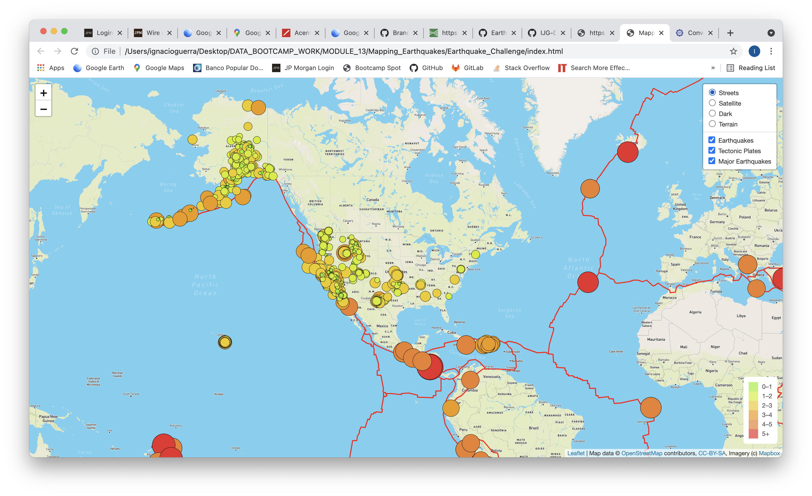
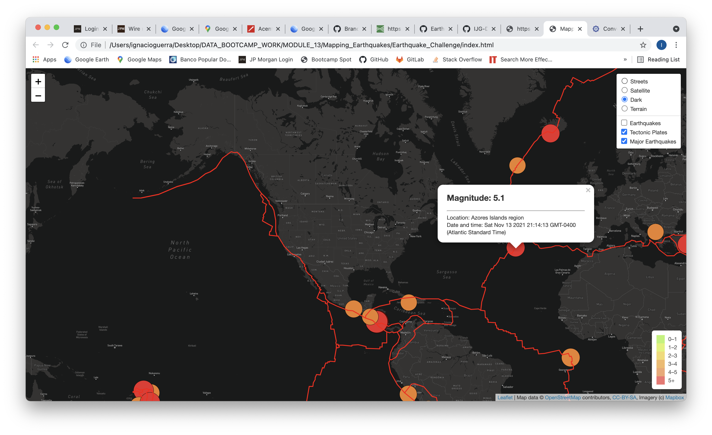
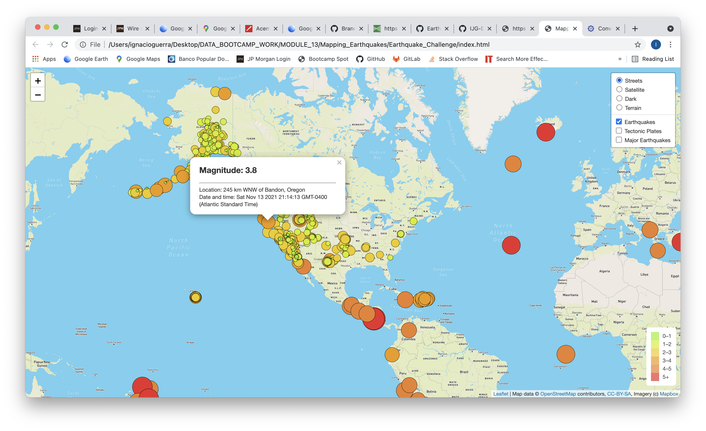
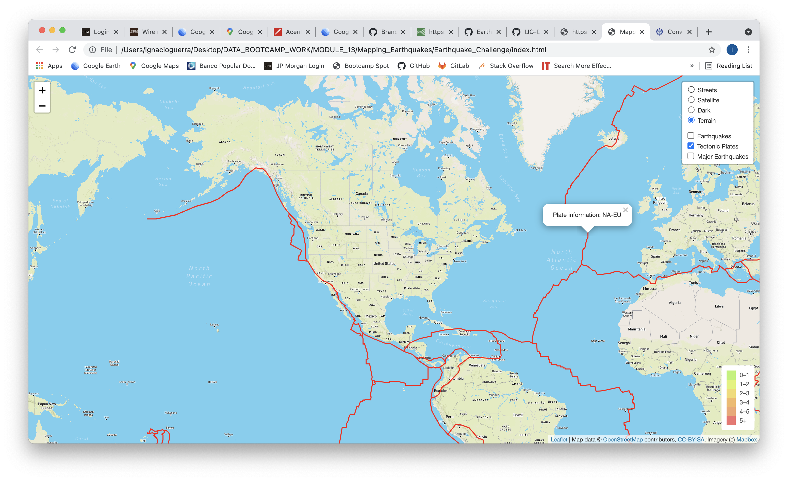

# Mapping Earthquakes

This is the repository for the Module 13 challenge. It shows the earthquake data in relation to tectonic plate location on earth, in layers that can be toggled on or off, as well as all earthquakes with a magnitude greater than 4.5 as a separate layer. The data can be shown in any of four different maps (street, satellite, dark and terrain).

## Methodology

The data is presented using *HTML* and *javascript*, utilizing *leaflet* to generate the maps and *d3* to read the *GeoJSON* data.

Earthquake data corresponds to the last 7 days, as provided by the USGS (*https://earthquake.usgs.gov/earthquakes/feed/v1.0/*)

Below are some images of the data displayed using the different options explained above.

### Map view when loaded

### Map in satellite view with tectonic plates, all earthquakes and major earthquakes

### Map in dark view showing only major earthquakes and pop-up labels

### Map in street view with all earthquakes showing pop-up labels

### Map in terrain view with tectonic plates showing pop-up labels

